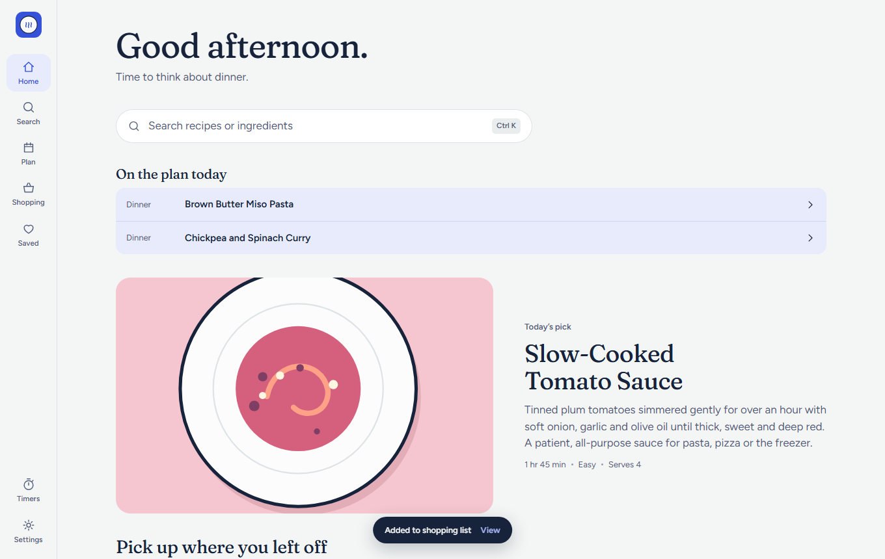
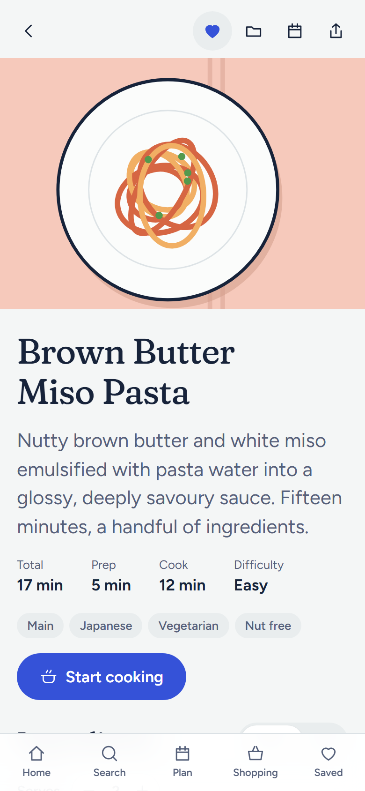
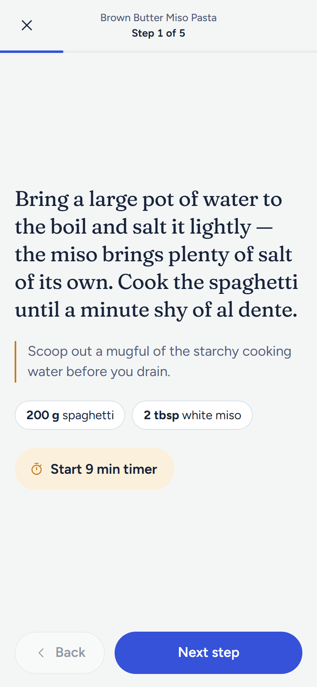
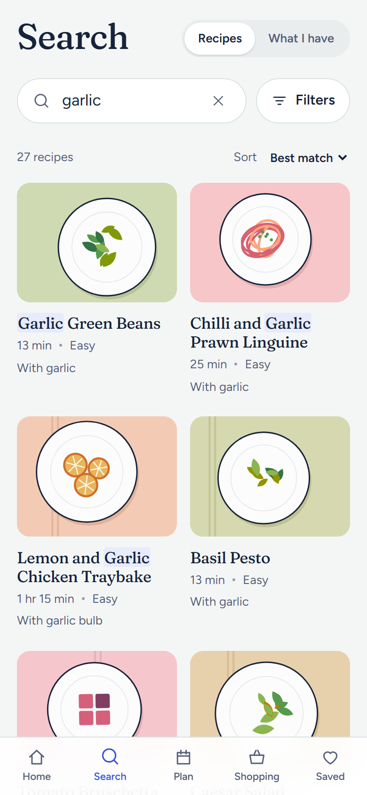
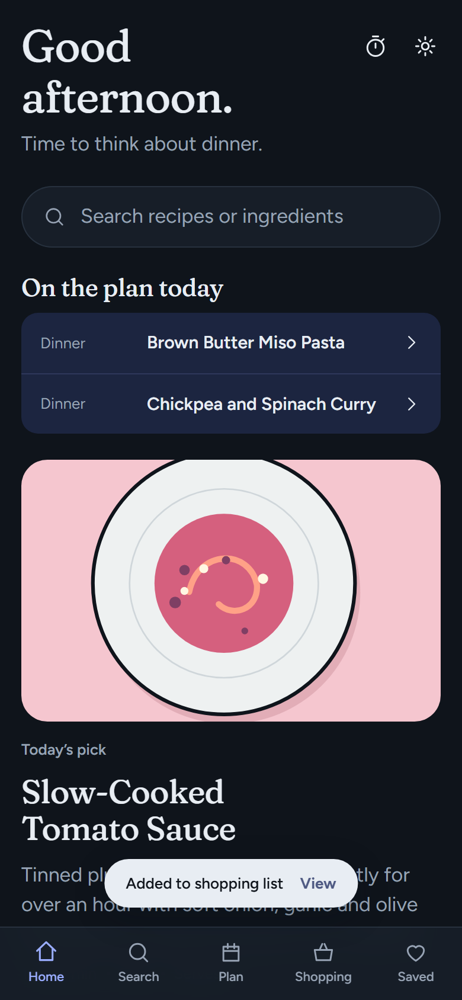

# Simmer

An open-source cookbook for desktop and Android. Search forgivingly, cook step
by step, plan the week, and let the recipe library keep itself up to date.



<p>
  
  
  
  
</p>

## What it does

- **Search that forgives typos.** Titles, ingredients, tags, cuisines and diets,
  with matches highlighted. `Ctrl`/`Cmd`+`K` jumps anywhere on desktop.
- **What can I make?** Tick what is in your kitchen and every recipe is ranked
  by how much of it you already have.
- **Recipes that adapt.** Scale servings, switch between metric and US
  measures, tick off ingredients as you go.
- **Cook mode.** One step at a time in large type, with the amounts that step
  needs, swipe or arrow keys to move, and the screen kept awake.
- **Timers.** Start one from any step, run several at once, get a chime and a
  system notification. They survive closing the app.
- **Meal plan and shopping list.** Plan a week, send it to a list that merges
  duplicate ingredients and groups them by aisle.
- **Yours.** Favourites, collections, ratings, private notes and a cooking log,
  all stored on your device. Back up and restore as a file.
- **Always current.** New and corrected recipes arrive on their own from the
  [recipe library](https://github.com/CheersLoveDani/simmer-recipes). The app
  updates itself from GitHub Releases: desktop builds download and install a
  new version when they start (never while a timer is running or you are in
  cook mode), and the Android app downloads the new APK and hands it to the
  system installer. Turn this off under Settings, About.
- **Two layouts.** A navigation rail and two-column recipes on wide screens;
  bottom tabs and sheets on phones. Light and dark themes.

## Install

Download the latest build for your platform from
[Releases](https://github.com/CheersLoveDani/simmer/releases/latest):

| Platform | File |
| --- | --- |
| Windows | `Simmer_x.y.z_x64-setup.exe` |
| macOS | `Simmer_x.y.z_aarch64.dmg` (Apple silicon) or `_x64.dmg` (Intel) |
| Linux | `.AppImage`, `.deb` or `.rpm` |
| Android | `Simmer_x.y.z_android.apk` |

The macOS build is not notarised, so the first launch needs right-click, Open.
On Android, allow installs from your browser when prompted.

## How recipes reach the app

Recipes live in a separate repository,
[simmer-recipes](https://github.com/CheersLoveDani/simmer-recipes), as one YAML
file each. On every change, CI there compiles them into a static feed:

```
v1/manifest.json           revision + a content hash for every recipe
v1/recipes.<hash>.json     the whole library in one file
v1/r/<id>.<hash>.json      one file per recipe
```

Simmer fetches the small manifest on launch and every few hours, compares
hashes with what it holds, and downloads only what changed (or the single
bundle when a lot did). The update is applied in one database transaction, so
an interrupted sync never leaves a half-updated library. A recipe the app
cannot read is skipped, not fatal. A snapshot of the library ships inside the
app, so it works offline from the first launch.

The feed is versioned (`v1/`). A breaking format change would be published
alongside as `v2/`, leaving older installs working.

To point a build at a different feed (a fork, say), set `VITE_FEED_URL` to its
`.../v1/` address at build time.

## Develop

Requirements: Node 20.19+, Rust, and the
[Tauri prerequisites](https://tauri.app/start/prerequisites/) for your platform.

```sh
npm install
npm run dev            # the app in a browser, http://localhost:1420
npm run tauri dev      # the desktop app
npm run tauri android dev

npm run typecheck
npm test               # unit and component tests (Vitest)
npm run e2e            # end-to-end tests at desktop and phone sizes (Playwright)
npm run seed           # refresh the bundled recipe snapshot from the live feed
```

The whole app runs in a plain browser; anything native (notifications,
updates, sharing, keeping the screen on) sits behind `src/platform/` with a web
fallback. That is what lets the end-to-end suite cover every feature.

```
src/
  domain/     pure logic: scaling, units, search, pantry, shopping, planner, timers, cover art
  sync/       feed fetching and diffing
  store/      IndexedDB and app state
  platform/   native features with browser fallbacks
  ui/         shared components
  features/   screens
e2e/          Playwright tests
src-tauri/    the native shell
```

### Releasing

1. Bump `version` in `package.json` and `src-tauri/Cargo.toml`.
2. Tag and push: `git tag v0.2.0 && git push --tags`.

The release workflow builds and signs every platform and attaches
`latest.json`, which running desktop apps check for updates. It needs these
repository secrets: `TAURI_SIGNING_PRIVATE_KEY`, `ANDROID_KEYSTORE_BASE64`,
`ANDROID_KEYSTORE_PASSWORD`.

## Licence

[AGPL-3.0-or-later](LICENSE). You are free to use, study, change and share
Simmer; if you distribute a modified version, or run one as a service, you must
release your source under the same licence.

Recipes are licensed separately under CC BY-SA 4.0 in the
[recipe repository](https://github.com/CheersLoveDani/simmer-recipes).
